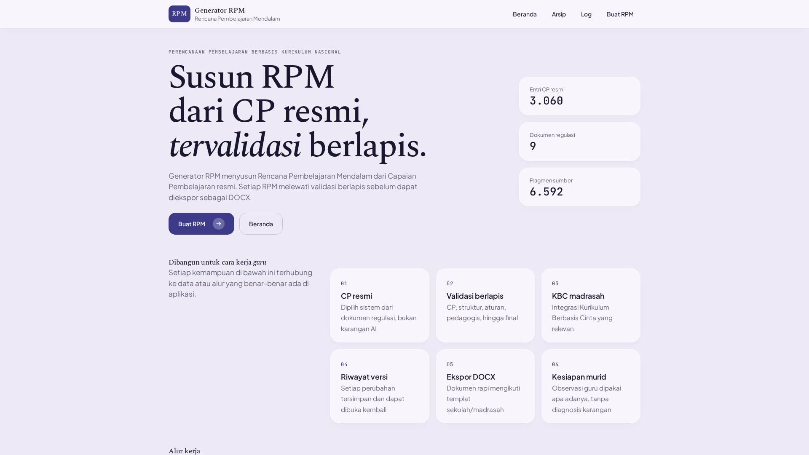
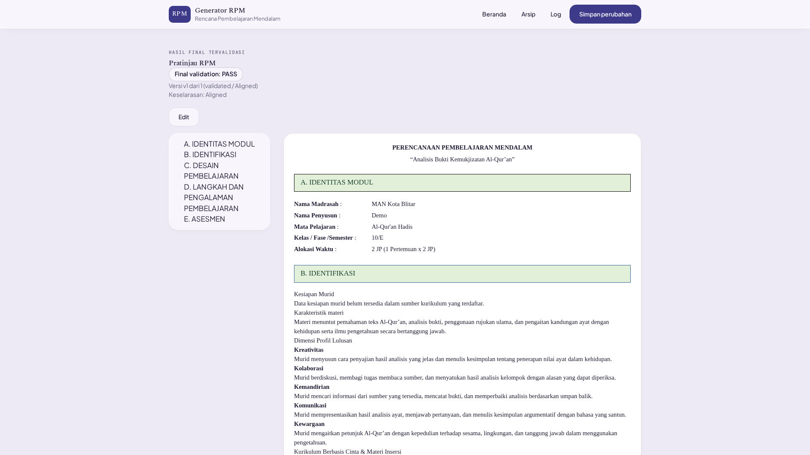

# RPM Generator: Rencana Pembelajaran Mendalam

Aplikasi pembuat RPP/RPM (Rencana Pembelajaran Mendalam) berbasis AI
untuk sekolah dan madrasah Indonesia. AI hanya menyusun konten
pedagogis; seluruh data normatif (CP, fase, elemen, profil lulusan)
berasal dari basis data kurikulum yang diekstrak dari 9 dokumen
regulasi kanonik di `Hukum/`. Setiap RPM melewati validasi berlapis
sebelum dapat diekspor ke DOCX.

## Pratinjau




## Status data (terverifikasi 2026-10-08)

- 6592 fragmen sumber, 3060 CP, 9 dokumen regulasi
- 1208 test pytest (51 berkas), uji frontend Node 163/163
- Backend Flask berjalan normal (`/api/health`), antarmuka web di `/app`

## Persyaratan

- Python 3.10 atau lebih baru (periksa dengan `python3 --version`)
- Git
- Gateway 9Router yang berjalan di `http://localhost:20128`.
  Gateway hanya diperlukan untuk pembuatan RPM baru. Tanpa gateway,
  aplikasi tetap dapat dibuka dan dipakai untuk melihat riwayat,
  pratinjau, serta ekspor DOCX.
- (Opsional) `tesseract-ocr` untuk audit kualitas OCR
- Pustaka Python yang tercantum di `requirements.txt`

## Pemasangan

### 1. Unduh repositori

```bash
git clone https://github.com/demile02/rpm-generator.git
cd rpm-generator
```

### 2. Pasang 9Router

Ikuti panduan pemasangan pada https://github.com/decolua/9router
hingga gateway berjalan di `http://localhost:20128`. Setelah itu,
buat combo bernama `rpm` di dashboard 9Router. Combo ini wajib ada,
aplikasi tidak bisa generate tanpa combo ini.

### 3. Pasang dependensi Python

```bash
python3 -m pip install -r requirements.txt
```

Catatan: `PyPDF2==4.0.0` tidak ada di PyPI, jadi dipakai `3.0.1`.

### 4. Isi berkas `.env`

```bash
cp .env.example .env   # Windows: copy .env.example .env
```

Buka berkas `.env` dengan editor teks, lalu isi:

| Variabel | Keterangan |
|---|---|
| `NINE_ROUTER_API_KEY` | Kunci API 9Router. Wajib diisi jika gateway mengaktifkan pemeriksaan kunci; boleh dikosongkan jika tidak. |
| `NINE_ROUTER_BASE_URL` | Default: `http://localhost:20128`. |
| `NINE_ROUTER_COMBO` | Default: `rpm` (jangan diubah). |
| `NINE_ROUTER_TIMEOUT` | Default: `120`. |
| `NINE_ROUTER_MAX_RETRIES` | Default: `2`. |

## Penggunaan

Jalankan perintah berikut satu per satu di terminal, dari dalam folder
proyek. Setiap blok kode di bawah siap disalin-tempel.

### 1. Jalankan server

```bash
python3 src/app.py
```

Biarkan terminal ini tetap terbuka selama aplikasi dipakai.

### 2. Pastikan server menyala

Buka terminal kedua, lalu jalankan:

```bash
curl http://localhost:5000/api/health
```

Hasil yang benar:

```json
{"status":"healthy","database":"connected","fragments":6592}
```

Jika hasilnya seperti itu, lanjut ke langkah 3. Jika terminal
menjawab `Failed to connect`, berarti server langkah 1 belum jalan.

### 3. Buka aplikasi

Buka tautan berikut di peramban:

```text
http://localhost:5000/app
```

## API (ringkasan)

- `GET /api/health`, `GET /api/stats`
- Kurikulum: `GET /api/systems`, `GET /api/subjects/<system>`,
  `GET /api/curriculum/options`, `GET /api/cp/<subject>/<phase>`,
  `POST /api/context/generate`
- Pembuatan: `POST /api/module/generate`,
  `GET /api/generation/status/<job_id>`
- Modul: `GET /api/modules`, `GET/PUT/DELETE /api/module/<id>`,
  `POST /api/module/<id>/regenerate`,
  `POST /api/module/<id>/finalize`,
  `GET /api/module/<id>/export-docx` (hanya untuk hasil final yang
  tervalidasi)
- Versi: `GET/POST /api/module/<id>/versions`,
  `GET/DELETE /api/module/<id>/versions/<no>`,
  `POST .../restore`
- Arsip: `POST /api/modules/<id>/archive|unarchive`
- Impor RPM: `POST /api/modules/import` (DOCX/PDF, maks. 10 MB)
- Buku ajar: `GET /api/buku`, `POST /api/buku/upload`
- Log: `GET/DELETE /api/generations`, `GET/DELETE /api/generations/<id>`

## Struktur proyek

```text
Hukum/            9 PDF regulasi kanonik (jangan diubah)
db/               rpm_generator.db (data universal disertakan di Git),
                  curriculum_mappings.json, document_registry.json,
                  extracted_fragments.json, tessdata/, source_documents/
templates/        Templatku.docx (acuan tata letak DOCX, ikut di Git)
src/              app.py, module_generation_pipeline.py,
                  curriculum_engine.py, curriculum_context.py,
                  rule_engine.py, pdf_extraction.py,
                  nine_router_client.py, module_store.py,
                  docx_renderer.py, db_initialization.py,
                  rpm_importer.py, buku_ajar.py
ui/               index.html, styles.css, app.js, api.js, render.js,
                  fonts/ + vendor-*.js lokal (offline-first),
                  tests/frontend.test.js
tests/            51 berkas pytest
AGENTS.md         spesifikasi dan aturan kerja
Design.md         token visual Atelier Glass
```

